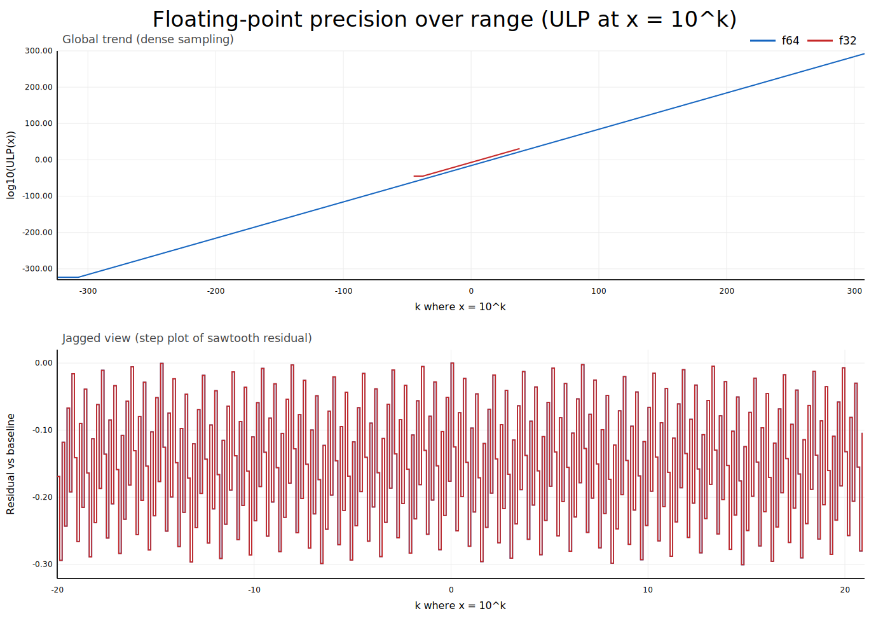

# Lesson 02: Float Math and Error Modes

This lesson uses the runnable examples in `src/main.rs`.

Run it:

```bash
cargo run -q
```

## What to look for

- Decimal mismatch: `0.1 + 0.2` is close to, but not exactly, `0.3`
- Accumulation error: repeating inexact operations can drift
- Catastrophic cancellation: subtracting nearly equal large values loses digits
- Scale dependence: absolute precision changes with magnitude

## Code example

```rust
fn decimal_representation_demo() {
    let a32: f32 = 0.1;
    let b32: f32 = 0.2;
    let a64: f64 = 0.1;
    let b64: f64 = 0.2;

    println!("f32: 0.1 + 0.2 = {:.10}", a32 + b32);
    println!("f64: 0.1 + 0.2 = {:.17}", a64 + b64);
}
```

## Visual intuition

Generate the precision graph:

```bash
cargo run -q --bin precision_graph
```

Output:

- `docs/precision_over_range.svg`



The top panel shows the global trend in ULP size.
The bottom panel shows the jagged exponent-bin structure.
